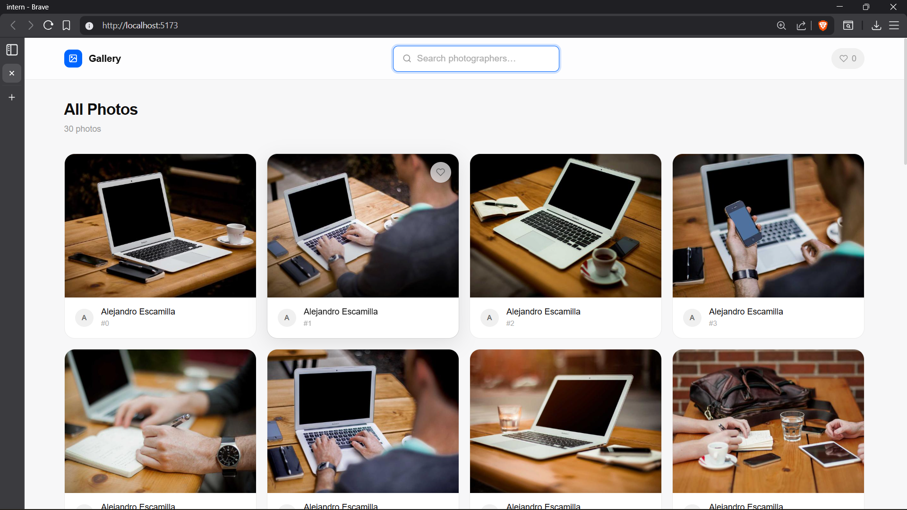
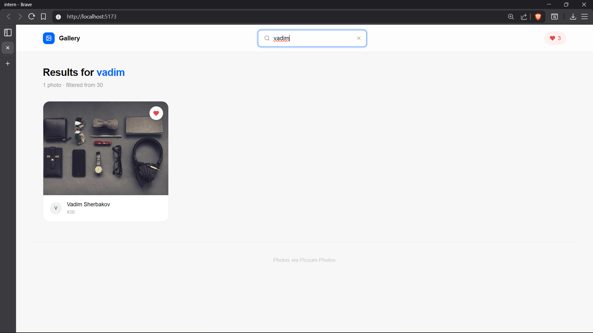
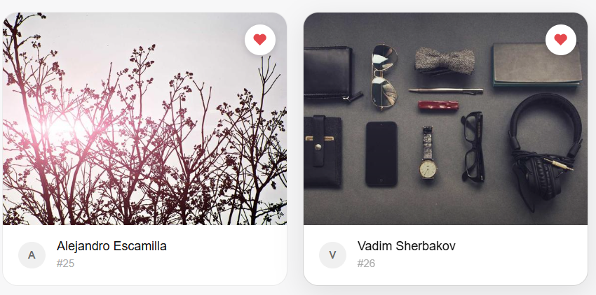

# Photo Gallery App

A responsive photo gallery built with React + Vite + Tailwind CSS as part of a frontend internship pre-screening assignment.

---

## Tech Stack

- **React 18** — functional components + hooks only
- **Vite** — project scaffolding and dev server
- **Tailwind CSS** — all styling, no component libraries

---

## Features

- Fetches 30 photos from the [Picsum Photos API](https://picsum.photos/v2/list?limit=30) on load
- Loading spinner while fetching, error message if fetch fails
- Responsive grid — 4 columns (desktop) → 2 columns (tablet) → 1 column (mobile)
- Real-time search filter by photographer name (no API calls, filters already-fetched data)
- Favourite any photo with the heart icon — state persists across page refreshes via `localStorage`
- Clean, modern minimal UI — light mode only

---

## Screenshots

| Gallery View | Search Filter | Favourites |
|---|---|---|
|  |  |  |


## Getting Started

### Prerequisites

- Node.js v18+
- npm v9+

### Install & Run

```bash
# 1. Clone the repo
git clone https://github.com/priyanshugaurav/photoGallery.git
cd photoGallery

# 2. Install dependencies
npm install

# 3. Start the dev server
npm run dev
```

Open [http://localhost:5173](http://localhost:5173) in your browser.

### Build for Production

```bash
npm run build
```

---

## Key Implementation Details

### `useFetchPhotos` — Custom Hook

Located in `src/hooks/useFetchPhotos.js`. Handles all data fetching logic in isolation from the UI. Returns `{ photos, loading, error }`. Uses an `cancelled` flag inside `useEffect` to prevent state updates on unmounted components.

```js
const { photos, loading, error } = useFetchPhotos(30);
```

### `useReducer` — Favourites State

Located in `src/reducers/galleryReducer.js`. Manages the favourites list with a `TOGGLE_FAVORITE` action. Chosen over `useState` because the state transition logic (add/remove + persist) belongs in one predictable place. Saves to and loads from `localStorage` automatically.

### `useMemo` — Filtered Photo List

In `App.jsx`, the filtered list is computed with `useMemo` so it only recalculates when `photos` or `query` actually changes — not on every render.

### `useCallback` — Search Handler

The `handleSearch` function is wrapped in `useCallback` so its reference stays stable across renders, preventing unnecessary re-renders in child components that receive it as a prop.

---

## API Used

**Picsum Photos** — free, no API key required.

```
GET https://picsum.photos/v2/list?page=1&limit=30
```

Returns an array of photo objects with `id`, `author`, `width`, `height`, and `download_url`.

---

## Assignment Requirements Checklist

| # | Requirement | Status |
|---|---|---|
| 1 | React + Vite + Tailwind, no UI libraries | ✅ |
| 2 | Fetch 30 photos, loading + error states | ✅ |
| 3 | Responsive grid (4 / 2 / 1 columns) | ✅ |
| 4 | Real-time search by author, no extra API calls | ✅ |
| 5 | Favourites with `useReducer` + `localStorage` | ✅ |
| 6 | Custom `useFetchPhotos` hook | ✅ |
| 7 | `useCallback` + `useMemo` with clear purpose | ✅ |

---

## Author

**Your Name**
[priyanshugaurav01@gmail.com](mailto:priyanshugaurav01@gmail.com) · [GitHub](https://github.com/priyanshugaurav)
